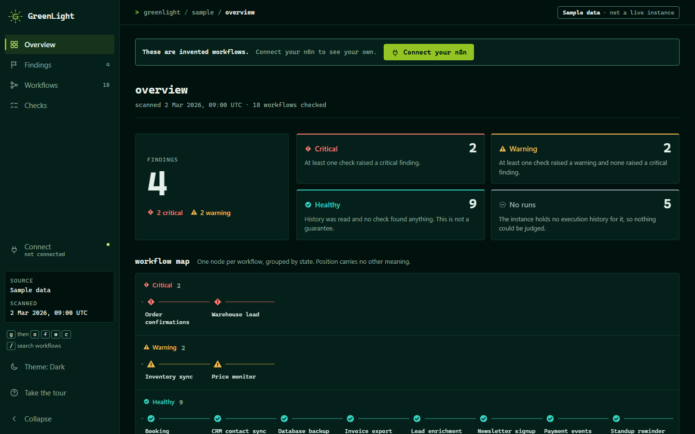
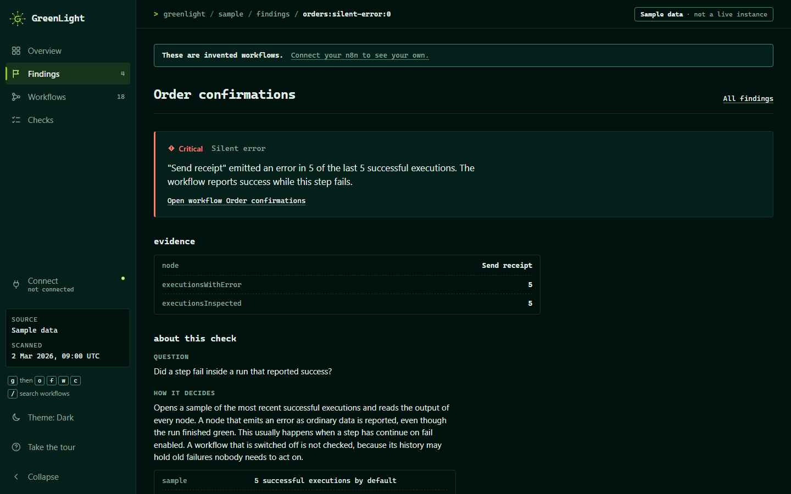
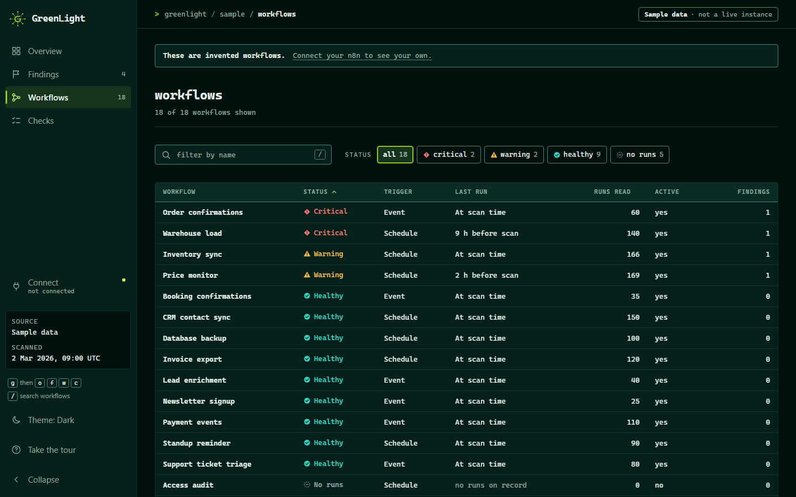
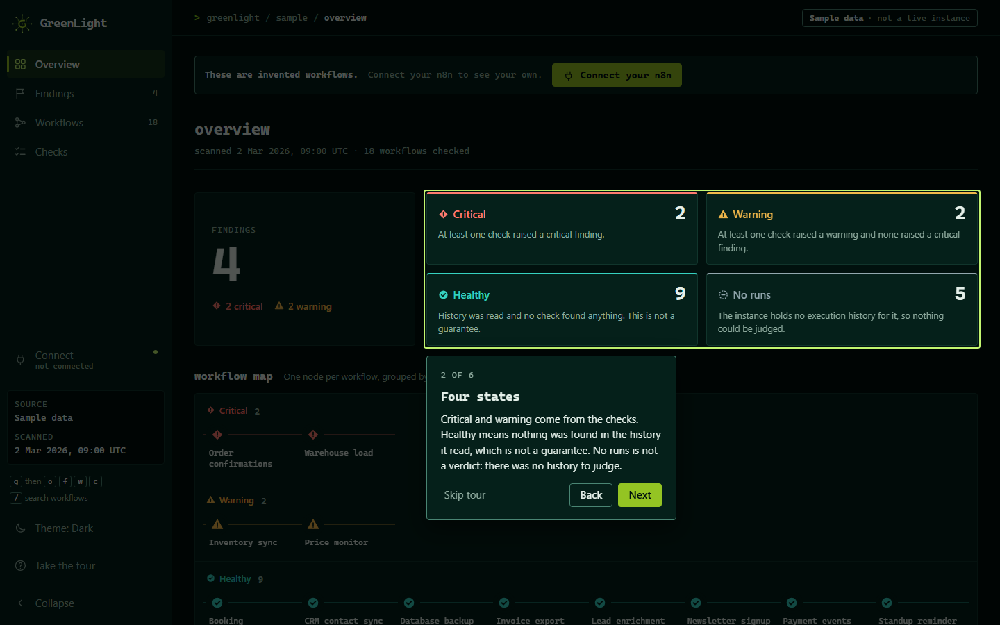
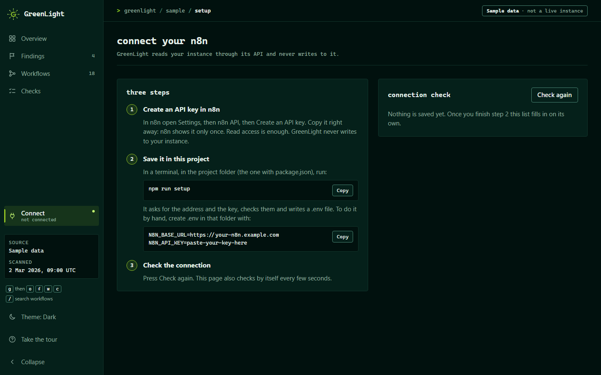
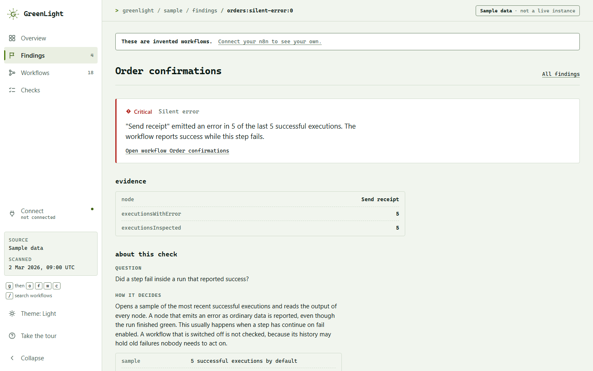
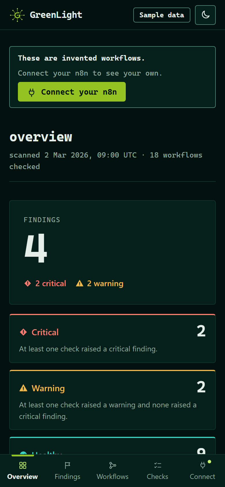

# GreenLight

[](https://github.com/jsanchez542-hub/greenlight/actions/workflows/ci.yml)
[](LICENSE)


**Finds the n8n workflows that fail while reporting success.**

A production workflow reported success for three weeks while it sent nothing at all.

The step that failed had "continue on fail" enabled, so its error travelled downstream
as ordinary data and every run finished green. What gave it away was the clock:
execution time had drifted from 1.2 to 10.5 seconds, because the node was retrying
against a revoked credential before giving up.

No dashboard shows that. Every run was a success, and the counter said so.

GreenLight reads an n8n instance through its API and looks for the failures that do not
announce themselves.



## Quick start

You need Node.js 22.12 or newer, and an n8n instance where you can create an API key.

```bash
git clone https://github.com/jsanchez542-hub/greenlight.git
cd greenlight
npm install
npm run setup
```

`npm run setup` walks you through it. It tells you where to create the key (in n8n, Settings,
then n8n API; read access is enough), asks for the address of your instance and the key, checks
the connection step by step and saves the result to a `.env` file that git ignores. If something
is wrong it says what, and what to do about it.

Then pick how you want to look:

```bash
npm run scan     # a report in the terminal
npm run panel    # the dashboard, at http://127.0.0.1:3000
npm run watch    # keep watching and get alerted when something new appears
```

If anything does not work, `npm run doctor` repeats the connection check and points at the step
that fails.

No instance at hand? `npm run example` prints a report for an invented one, and the dashboard
shows the same sample data, clearly labelled, until you connect your own.

## What it looks for

| Check | Question it answers |
| --- | --- |
| Silent error | Did a step fail inside a run that reported success? |
| Duration drift | Is this workflow suddenly much slower than it used to be? |
| Silence | Has a scheduled workflow stopped running without being switched off? |
| Frequency drop | Is it still running, but far less often than before? |

Each check is derived from a failure that happened in a real instance, not from a list of
things that might theoretically go wrong.

## Example

```
GreenLight  scanned 18 workflows  4 findings, 2 critical

CRITICAL Order confirmations
         "Send receipt" emitted an error in 5 of the last 5 successful
         executions. The workflow reports success while this step fails.
             node                 Send receipt
             executionsWithError  5
             executionsInspected  5

CRITICAL Warehouse load
         Active workflow has not run for 9.0 h despite running every 1.0 h. Its
         trigger is most likely no longer registered.
             lastRunAt      2026-03-02T00:00:00.000Z
             silentFor      9.0 h
             usualInterval  1.0 h

WARNING  Inventory sync
         Typical run time rose from 1.2s to 10.5s, 8.6 times slower than before,
         which usually means a downstream service is retrying before it gives up.
             baselineMedian   1.2s
             baselineP95      1.5s
             recentMedian     10.5s
             baselineSamples  142
             recentSamples    24

WARNING  Price monitor
         Ran 1 time in the last 24h where roughly 24 were expected. A schedule
         was probably edited.
             recentRuns    1
             expectedRuns  24
             windowHours   24
             baselineRuns  168
```

That report is the real output of the program, run against a synthetic instance so the
example can show every check at once. `npm run example` reproduces it from
[`examples/synthetic-instance.mjs`](examples/synthetic-instance.mjs).

## The dashboard

`npm run panel` starts a local dashboard that scans your instance and keeps the result fresh.

| | |
| --- | --- |
|  |  |
| Each finding shows the evidence it rests on and what to review. | Every workflow that was checked, with its state, trigger and last run. |
|  |  |
| A short tour the first time you open it. | **Connect your n8n**: three steps and a live connection check. |
|  |  |
| A light and a dark theme, with a switch. | It works on a phone-sized screen too. |

- **Overview, Findings, Workflows and Checks.** The last page explains what each check looks for
  and the exact defaults it uses.
- **Live or sample.** With a configured instance it scans on its own and shows how old the data is.
  Without one it shows sample data, labelled as such.
- **A first-run guide.** The first time you open it there is a short tour, and a **Connect your
  n8n** page that runs the same step-by-step check as `npm run doctor`.
- **Light and dark.** A switch in the sidebar, and in the top bar on a phone, cycles System, Light
  and Dark and remembers the choice. System follows your operating system.
- **It works on a phone-sized screen.** It needs a current browser: Chrome or Edge 123, Firefox 120
  or Safari 17.5 and newer.
- **Keyboard first.** `g` then `o`, `f`, `w` or `c` moves between pages, and `/` searches workflows.

The dashboard has no login of its own. It listens on `127.0.0.1` and refuses other host names, so
it is meant for your own machine. See [SECURITY.md](SECURITY.md) before putting it anywhere else.

## Watching and alerts

```bash
npm run watch
```

Scans on a schedule and reports only what changed. A finding is announced once when it
appears and once when it has stayed away for two scans in a row, so a borderline case that
flickers does not produce an alert every few minutes. What was already reported is kept in a
small file (`.greenlight-state.json`), so restarting does not repeat old alerts.

If the scan itself cannot run three times in a row, which usually means the instance is down
or the key was revoked, it says so, because a watcher that fails quietly is the problem this
project exists to solve. It says so again when scanning resumes.

Without a webhook, changes are only printed. With one, each change is posted as JSON:

```json
{
  "source": "greenlight",
  "type": "findings",
  "subject": "GreenLight: 1 new critical finding on n8n.example.com",
  "text": "CRITICAL Order confirmations (silent-error)\n\"Send receipt\" emitted an error in 5 of the last 5 successful executions. ...",
  "instance": "n8n.example.com",
  "scannedAt": "2026-03-02T09:00:00.000Z",
  "newFindings": [
    {
      "workflowId": "orders",
      "workflowName": "Order confirmations",
      "detector": "silent-error",
      "severity": "critical",
      "summary": "\"Send receipt\" emitted an error in 5 of the last 5 successful executions. ..."
    }
  ],
  "resolvedFindings": []
}
```

`type` is `findings`, `scan-failing` or `scan-recovered`. `subject` and `text` are written to be
used as they are in an email or a chat message; the arrays carry the same information as data.
If a delivery fails, the alert is kept and tried again on the next scan.

GreenLight does not know what is behind the URL, so it works with anything that accepts a JSON
POST. [`examples/n8n-alert-to-email.json`](examples/n8n-alert-to-email.json) is a two-node n8n
workflow that turns the alert into an email: import it, choose your own SMTP credentials and
addresses, and create a Header Auth credential whose name is `Authorization` and whose value is
`Bearer ` followed by your token. Then set `GREENLIGHT_WEBHOOK_URL` to the production URL of its
webhook and `GREENLIGHT_WEBHOOK_TOKEN` to the same token. The webhook URL is treated as a secret
and never appears in error messages.

`npm run watch -- --once` runs a single scan and exits, with the same exit codes as a normal
scan, so it can run from cron or a scheduler instead of staying alive.

## Configuration

`npm run setup` writes these to `.env`. A value set in the environment wins over the file.

| Variable | Default | Purpose |
| --- | --- | --- |
| `N8N_BASE_URL` | required | address of the instance, without `/api/v1` |
| `N8N_API_KEY` | required | API key with read access |
| `GREENLIGHT_EXECUTION_LIMIT` | 200 | executions read per workflow |
| `GREENLIGHT_DETAIL_SAMPLE` | 5 | executions inspected node by node |
| `GREENLIGHT_WEBHOOK_URL` | none | where `watch` posts alerts |
| `GREENLIGHT_WEBHOOK_TOKEN` | none | sent as `Authorization: Bearer <token>` |
| `GREENLIGHT_INTERVAL_MINUTES` | 5 | time between scans in `watch` |
| `GREENLIGHT_NOTIFY_MIN` | `warning` | `critical` to alert only on critical findings |
| `GREENLIGHT_STATE_FILE` | `.greenlight-state.json` | what `watch` has already reported |

Only read endpoints are used. GreenLight never writes to the instance; the only thing it sends
anywhere is the alert that `watch` posts to the webhook you configure.

## Commands

| Command | What it does |
| --- | --- |
| `npm run setup` | guided first-time setup, saves `.env` |
| `npm run doctor` | checks the connection step by step |
| `npm run scan` | scans once and prints the report; add `-- --json` for structured output |
| `npm run watch` | scans on a schedule and alerts on changes |
| `npm run panel` | installs and starts the dashboard |
| `npm run example` | prints the report for a synthetic instance |

`scan` and `watch --once` exit with 0 when nothing is found, 1 when something is, and 2 when the
scan could not run, so they can gate a deployment pipeline. Outside a clone of this repository the
same commands are `greenlight init`, `greenlight doctor`, `greenlight`, `greenlight watch`.

## Output

`--json` returns one object. `findings` holds what the checks raised, critical first.
`workflows` holds one entry per workflow, including the healthy ones, so a consumer can
show what was checked and not only what failed.

```json
{
  "version": 1,
  "scannedAt": "2026-03-02T09:00:00.000Z",
  "workflowsScanned": 18,
  "workflows": [
    {
      "id": "inventory",
      "name": "Inventory sync",
      "active": true,
      "trigger": "schedule",
      "executionsRead": 166,
      "lastStartedAt": "2026-03-02T09:00:00.000Z",
      "health": "warning"
    }
  ],
  "findings": [
    {
      "workflowId": "inventory",
      "workflowName": "Inventory sync",
      "detector": "duration-drift",
      "severity": "warning",
      "summary": "Typical run time rose from 1.2s to 10.5s, ...",
      "evidence": { "baselineMedian": "1.2s", "recentMedian": "10.5s" }
    }
  ]
}
```

`health` is `critical`, `warning`, `healthy` or `no-runs`. `no-runs` means the instance
keeps no history for that workflow, so nothing could be judged; it is not a verdict.
`trigger` is `schedule` for workflows started by a clock and `event` for everything else.
`version` changes only when a field is removed or changes meaning. The complete output for
the example above is in [`examples/scan-result.json`](examples/scan-result.json).

The same result is available from code:

```ts
import { N8nClient, scan } from 'greenlight';

const client = new N8nClient({ baseUrl, apiKey });
const result = await scan(client, { executionLimit: 200, detailSampleSize: 5 });
```

## How it decides

**Thresholds come from each workflow, not from a config file.** A workflow that always
takes ten seconds is not a problem. One that used to take one second and now takes ten
is. Duration drift requires the recent median to clear both the historical 95th
percentile and twice the historical median, because either condition alone reports
ordinary variation.

**It refuses to judge without enough history.** Duration drift needs ten baseline runs and
three recent ones, frequency drop needs ten baseline runs, and silence needs three runs to
know what a usual interval is. Silent error needs no history at all, because one error
inside a run that reported success is already the finding. An alert that is confident and
wrong costs more trust than a missed one.

**The remaining defaults are stated, not hidden.** Silence is reported when a scheduled
workflow has been quiet for more than four times its usual interval between runs. Frequency
drop is reported when the last 24 hours hold fewer than half the runs the history predicts;
a workflow that did not run at all in that window is judged by the silence check instead.

**It reads the trigger node rather than inferring the schedule.** The first version
worked out whether a workflow was scheduled by measuring how evenly its runs were
spaced. That passed every synthetic test and then failed on a real instance: a burst of
manual tests against a webhook workflow is evenly spaced, so it was reported as a dead
trigger. Polling triggers are excluded for a different reason, one that only shows up in
production data. They record a run only when they find something, so an idle Gmail
trigger and a broken one look identical from the outside.

**It leaves alone what was switched off.** Another lesson from a real instance: a workflow
paused on purpose kept its old failed runs in history and was reported as critical
indefinitely. Silent errors are only judged for active workflows.

**Detection is deterministic.** Every finding is a comparison between numbers, which is
why each one can be covered by a test and reproduced from the evidence printed beside it.

## Limits

It reads whatever execution history the instance still holds, so a short retention window
limits what can be compared. Workflows that have never run are skipped rather than guessed at.
Detail inspection is sampled, not exhaustive, because that endpoint is expensive. The scan reads
workflows one after another, so on a large instance it takes as long as the API takes to answer.

## Project layout

| Folder | What is in it |
| --- | --- |
| `src/` | the scanner: n8n client, the four checks, `watch`, and the setup assistant |
| `tests/` | its tests |
| `web/` | the dashboard, a separate Next.js project |
| `examples/` | the synthetic instance, its output, and the n8n workflow for email alerts |
| `assets/logo/` | the logo in the sizes a page needs |

The scanner has no production dependencies and runs on Node alone.

## Contributing

Issues and pull requests are welcome; [CONTRIBUTING.md](CONTRIBUTING.md) says what makes a good
change and how to add a check. Report security problems as described in [SECURITY.md](SECURITY.md).

## License

[MIT](LICENSE) © Miguel Sanchez Torres
